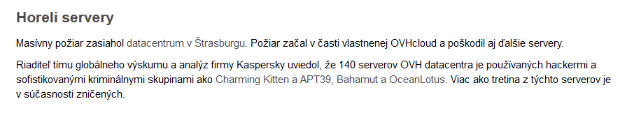

Souhrn věcí co mě zaujali v 10. týdnu (11.-17.3.) roku 2021.

- [Jak jsem se snažil upozornit armádu, že jim vypršel SSL certifikát](https://twitter.com/michalb_cz/status/1370608837837918208)
- [Hrot](https://store.steampowered.com/app/824600/HROT/) - výborná nová česká retro střílečka
    - skvěla hratelnost 
    - vypadá to jak Quake 1 z Československa
    - je to napsáne v Pascalu !!!
- Znáte sk-cert.sk ?
    - sk-cert.sk je slovenská obdoba českého NUKIB čili starají se o národní kyberbezpečnost
    - zaujal mě jejich blog, kde pravidelně zveřejnuní články TL;DR; se stručným popisem nejdůležitějších událostí na poli bezpečnosti za uplynulý týden. Nic podobného jsem na československém webu zatim neviděl a rád to budu číst pro rychlou orientaci.
        - [Např. tento týden](https://www.sk-cert.sk/sk/tldr-praha-aj-oslo-na-muske-hackerov-zneuzivaju-aj-proces-ockovania-10-tyzden/index.html)
        
        Zajímavý komentář o používání data centra různými kriminálními aktéry. Skoro to vypadá, že MI5 došla trpělivost :)
- [Komerční banka hledá PHP vývojáře na greenfield projekt](https://kb.jobs.cz/detail-pozice/?id=G2-1555268544-aden_brand0)
    - V roce 2021 začínat PHP projekt v bance? Zajímavé... Osobně považuji PHP za takový budoucí Cobol malých webů 
      a věštím, že to KB nepřinese žádnou přidanou hodnotu. Uvidíme. 
      *Poznámka: aktuálně pracuji v KB v týmu pomáhajícímu s adopcí DevOps v roli vývojáře*
- Znáte [BFG Repo-Cleaner](https://rtyley.github.io/bfg-repo-cleaner/) ?
    - Narazil jsem na něj ve výborné [github dokumentaci](https://docs.github.com/en), když jsem zkoumal [GitHub Actions](https://github.com/features/actions). Vypadá to na hodně užitečný nástroj - mimo jiné na elegantní odstraňování secrets (hesla, api klíče apod.) z git historie. Jednou jsem něco podobného řesil přes git-filter-branch a triviální to rozhodně nebylo.